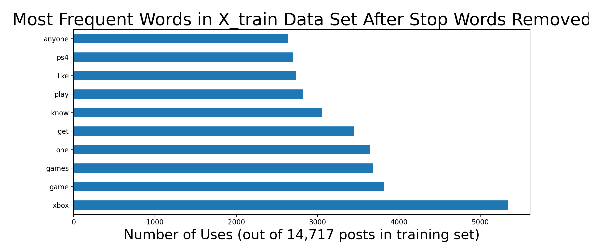

- [Problem Statement](#Problem-Statement)
- [Summary](#Summary)
- [Next Steps](#Next-Steps)
- [Data Dictionary](#Data-Dictionary)
- [External Resources](#External-Resources)

---

## Problem Statement

As a data analyst for Microsoft, I have been tasked with exploring differences and similarities between r/Xbox and r/Playstation posts on Reddit, hopefully thereby futhering knowledge about what might be important amongst those posts' respective authors. In the course of my analysis I will build several classification models that distinguish between posts from each subreddit, however the goal is specifically to look at the differences between the most recurring words in each subreddit to try to identify ways to market to Playstation subredditors and potentially win their business when they are choosing their next console.

---

## Summary

The [first step in my research](#https://git.generalassemb.ly/willg/project_3/blob/master/notebooks/01_Data_Scraping.ipynb) was to collect reddit posts from each subreddit - my goal was 10,000 of each. I wrote a function in python to perform the scraping from pushshift.io and built in filters to ensure that I got posts which were:  
1. text
2. not "removed" (deleted by author after posting)
3. chronological  

I also built in a random time delay between scrapes so that I did not overload pushshift's servers with requests. My function automatically ran on each subreddit, filtering posts as it went via the criteria listed above, until my number of posts met or exceeded 10,000. In total I collected 10,005 posts from r/Xbox and 10,021 posts from r/Playstation.

My second task was [Cleaning and EDA](#https://git.generalassemb.ly/willg/project_3/blob/master/notebooks/02_EDA.ipynb) - examining the data I had scraped and looking for errors, empty values, and patterns. In preparation for my NLP modeling, I combined the 'Title' and 'Selftext' string values into one concatenated column so that my model would have more words to search through.

I also did some preliminary examination of words that were most common across both subreddits combined, as visualized in the bar chart below:

We can see that the words we might expect to appear relative to the subject matter are indeed present, including 'ps4', 'ps5', and 'xbox', as well as common video game vocabulary like 'account' and 'play'. By far the most frequent word was "xbox", and many xbox subredditors used it more than once per post!

I did similar analysis for each of the subreddits individually. Here are two bar charts of the most frequent words in the Xbox subreddit - before and after custom stop word removal:

We can see that the words 'console' and 'controller' appear in the top 10 overall and after we remove other "xbox-specific" terms they become the most frequent representatives from their subreddit. This suggests that many of the authors in r/Xbox are inquiring / troublshooting with regards to hardware on a regular basis.

These are two bar charts of the most frequent words in the Playstation subreddit - before and after custom stop word removal:

Note that 'account' appears in both the top 10 most frequent words overall AND features most prominently after other "playstation-adjacent" terminology has been removed. We could infer that r/Playstation users may discuss software or login/account issues frequently. Spoiler alert! This suspicion will be confirmed with modeling.

After scraping and EDA, I moved into [Modeling](#https://git.generalassemb.ly/willg/project_3/blob/master/notebooks/03_Modeling.ipynb) and tested several different scaler and classifier combinations to find the most accurate fit.

This is a bar chart of the most frequent 10 words across all posts in my most accurate Count Vectorizer + Naive Bayes model:

This model had fairly good accuracy, but low precision brought my F1 score down and overall accuracy was not as good as subsequent Random Forest or Logistic Regression models.

This is a table of the most distinctive words between the two subreddit as scored by my Random Forest model. Unsurprisingly, they are words we would distinctly associate with these respective brands. This makes for a strong (over 92% accuracy model), however it does not tell us much more than we might have intuitively surmised.

| ngram(1,2)  |   importance |
|:------------|-------------:|
| xbox        |    0.114827  |
| ps4         |    0.0623533 |
| playstation |    0.04113   |
| ps5         |    0.0340841 |
| series      |    0.0224452 |
| xbox one    |    0.0168698 |
| ps          |    0.0160656 |
| sony        |    0.0120391 |
| psn         |    0.0119337 |
| microsoft   |    0.0117509 |

Similaraly, my final production model which used Logistic Regression also found that similar unique words are the best post differentiators:

| ngram (1,2) |     coef |   exp_coefs |   coef_abs |
|:------------|---------:|------------:|-----------:|
| playstation |  2.64269 |   14.0509   |    2.64269 |
| ps5         |  2.47732 |   11.9094   |    2.47732 |
| ps4         |  2.12555 |    8.37747  |    2.12555 |
| xbox        | -2.03688 |    0.130436 |    2.03688 |
| ps          |  1.88504 |    6.58661  |    1.88504 |
| psn         |  1.69428 |    5.44274  |    1.69428 |
| sony        |  1.46644 |    4.33377  |    1.46644 |
| series      | -1.43306 |    0.238577 |    1.43306 |
| ps3         |  1.19648 |    3.30845  |    1.19648 |
| dualshock   |  1.00245 |    2.72495  |    1.00245 |

This table lists the largest coefficients (sorted by absolute value) so we include the largest positive and negative values. The center column displays the exponentiated coefficients, allowing us to say, for example, that with all other things held constant, the presence of the word "playstation" in a post makes it 14 times more likely to be from the Playstation subreddit. Empirical... if somewhat elementary. These words give us a strong model and therefore have use, but for true takeaways I needed to dig deeper.

More interestingly - here is a table of the strongest postitive coefficients *after custom stop word removal*, i.e. taking out words that we would expect to find in only one subreddit or the other. This is from my final production model which used a Count Vectorizer in conjunction with Logistic Regression:

| ngram (1,2) |     coef |   exp_coefs |   coef_abs |
|:------------|---------:|------------:|-----------:|
| last us     | 0.891795 |     2.4395  |   0.891795 |
| remote play | 0.874625 |     2.39798 |   0.874625 |
| banned      | 0.694134 |     2.00197 |   0.694134 |
| hacked      | 0.681458 |     1.97676 |   0.681458 |
| fall guys   | 0.670572 |     1.95535 |   0.670572 |
| wallet      | 0.665569 |     1.9456  |   0.665569 |
| safe mode   | 0.654261 |     1.92372 |   0.654261 |
| database    | 0.614393 |     1.84853 |   0.614393 |
| 3d          | 0.58513  |     1.79522 |   0.58513  |
| network     | 0.582289 |     1.79013 |   0.582289 |

After extensively removing unique identifying words from the model, here are the 10 strongest postitive coefficients (meaning they are most indicative of our "1" which is r/playstation). If I were to generally categorize these words, I would group them as:  
- Playstation exclusive games like Last (of) Us, Fall Guys (others were added to the stop word list to dig deeper)
- Account / security concerns i.e. banned, hacked, wallet, safe mode, network, database
- Highly anticipated features i.e. remote play and 3d  

Based on my analysis, I would recommend that any marketing efforts aimed at winning over former playstation users focus on Microsoft's answers to these concerns. Specifically, marketing referring to upcoming special Xbox-only games, ease of use and/or security of the Xbox account and online systems, and cutting edge advancements in online and remote play.

---

### Next Steps

With more time and resources, I would be interested in pursuing:  
- deeper evaluation of posts by authors that appear in both subreddits; my preliminary EDA found 183 unique authors that showed up in both r/xbox and r/playstation
- further sentiment analysis; I found average sentiment to be slightly positive (~.27) but I could look deeper into words associated with negative and positive posts, and try to find the range of sentiment for each subreddit
- focused analysis on the Xbox subreddit to better identify their authors' heartburns and hot buttons

---

### Data Dictionary

|Feature|Type|Description|
|---|---|---|
|**subreddit**|str|Subreddit that post came from|
|**id**|str|Unique post ID|
|**author**|str|Reddit username of poster|
|**num_comments**|int|Number of comments post received|
|**selftext**|str|Optional subtitle area for additional post title text|
|**title**|str|Title of post|
|**upvote_ratio**|float|Ratio of upvotes on post|
|**url**|str|Web address of post|
|**all_text**|str|Concatenation of selftext and title features; used as X for NLP model|

---

### External Resources
https://pushshift.io/